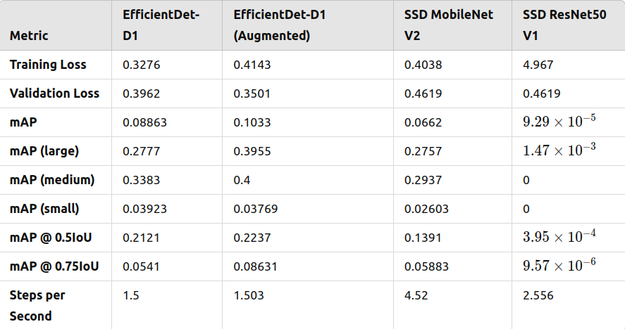
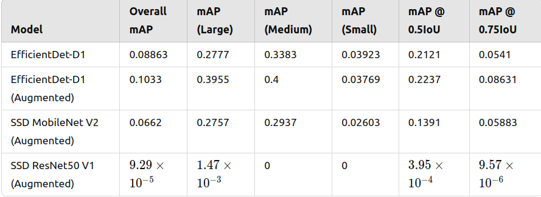
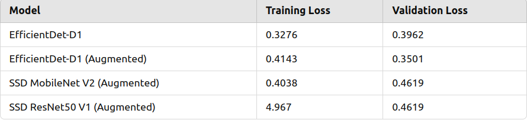

**We perform our object detection using the following models:**
1. EfficientDet-D1
2. EfficientDet-D1 with Data Augmentation
3. SSD MobileN Net V2 with Data Augmentation
4. SSD Resnet 50 v1 with Data Augmentation.

**Data Augmentation Done:**
1. Random Horizontal Flip

2. Random scale and crop and pad to square

3. Random vertical flip

4. Random adjust brightness

5. Random adjust contrast

The Summary of the training and evaluation for the various models can be found in the figure above. The figures where gotten from the tensorboard log located in the `logs/` directory for the respective models.

**Best Model Recommendation**
The EfficientDet-D1 with data augmentation happens to be the best performing model from the figure above. It has the highest overall mAP of **0.1033**, with also a strong performance on large and medium objects and a very competitive precious across IoU thresholds. 

It also has the lowest validation loss of **0.3501**, indicating good generalization.

**Observation for Validation Loss vs Training Loss**

1. As observed from the table above the **validation loss is most of the times higher than the training loss**, this can be as a result of genaralization to unseen data.

2. The **EfficientDet-D1 with Data Augmentation* displays a lower valiadtion loss when compared to its training loss, this indicates a better regularization and reduced overfitting.

3. The **SSD ResNet50 v1** has excessively high training loss, this indicates potential issues with model convergence and is therefore not suitable for the task.

**Expected Behavoiur**

1. It is normal for the validation loss to most of the times surpass the training loss as the training loss benefits from the exposure to the same data.

2. Models such as SSD ResNet50 v1 with poor generalization appear to have a significant gap between training and valiadtion metrics.

**Suggestions on how to Improve Performance**

1. **Focus on Small Object Detection**:
   - One can incorporate higher-resolution input images to improve the model's ability to detect small objects.
   - Make Use of techniques like feature pyramid networks (FPN) to improve object detection for small objects.

2. **More Data Augmentation**
   - We can expand the augmentation pipeline with additional techniques like random rotation, mosaic augmentation or cut mix.

3. **Hyperparameter Tunning**:
    - We can optimize learning rates, batch size and regularization parameters to reduce loss and improve convergence.
  
4. **Try other Architecture**:
   - State-of-the-art modles like Yolov8 or Faster R-CNN can provide improved recall and precision.
  
5. **Add more Epochs**:
   - Adding more epochs can help improve mAP.

6. **Multi-Scale Training**:
    - We can train models on multi-scale inputs to improve detection across various object sizes.

**Conclusion**
The **EfficientDet-D1 with Data Augmentation** is the best choice for this dataset, because it balances good precision with reasonable loss metrics. With further improvements to the training process. 

We deploy the **Efficientdet-D1 with Data Augmentation** on the `2_deploy_model.ipynb` and store the video in `output_video/output_efficientdet_d1_aug.avi`

**Click Image to Watch Video**

