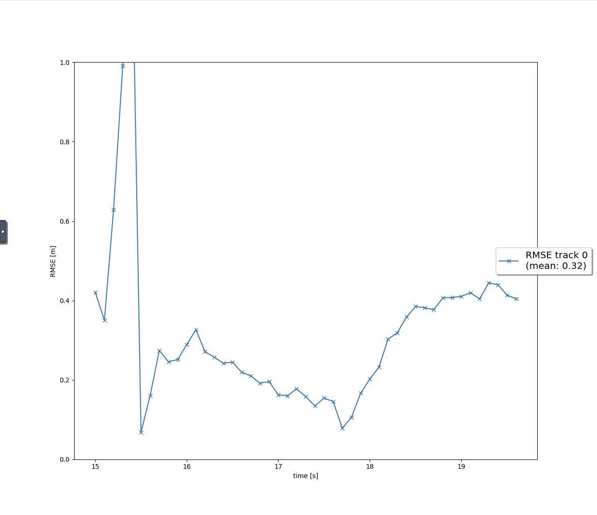
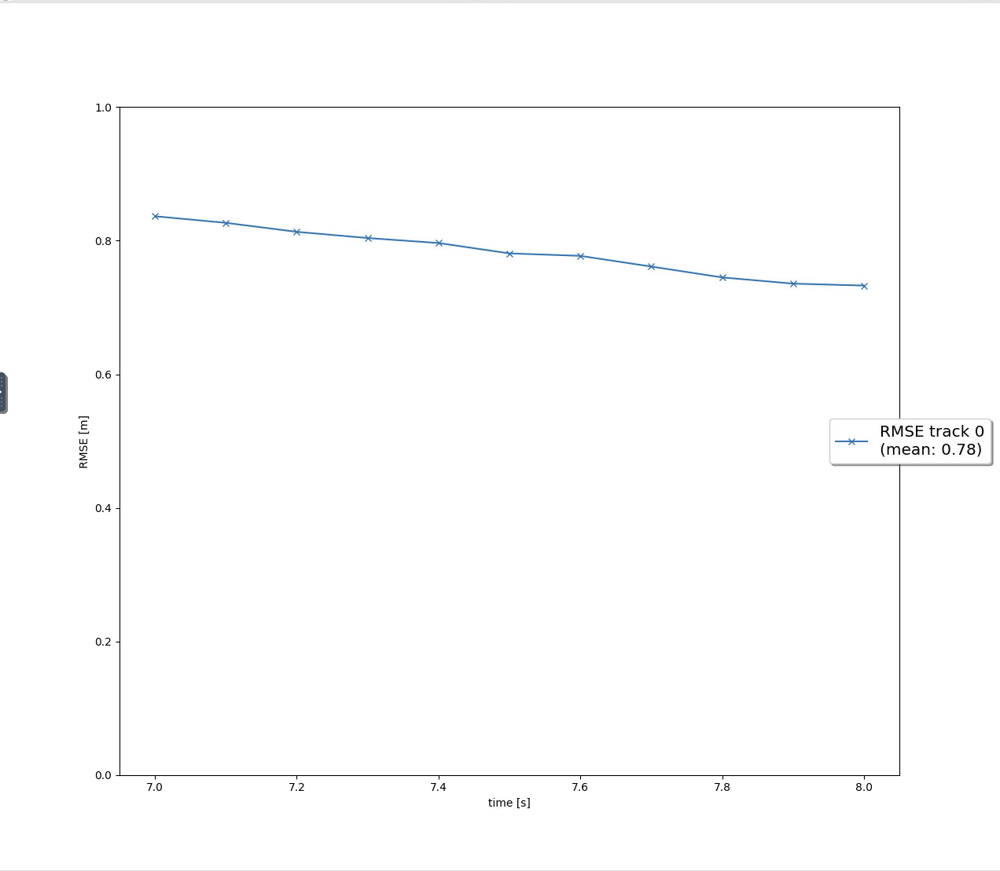
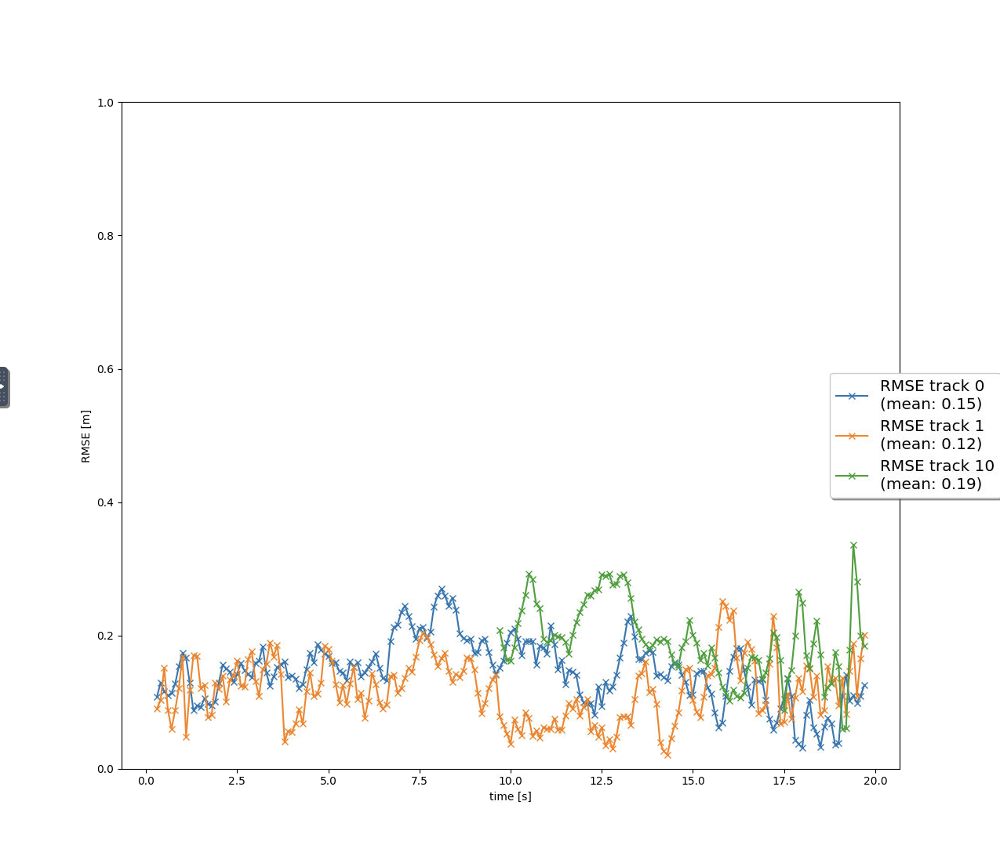
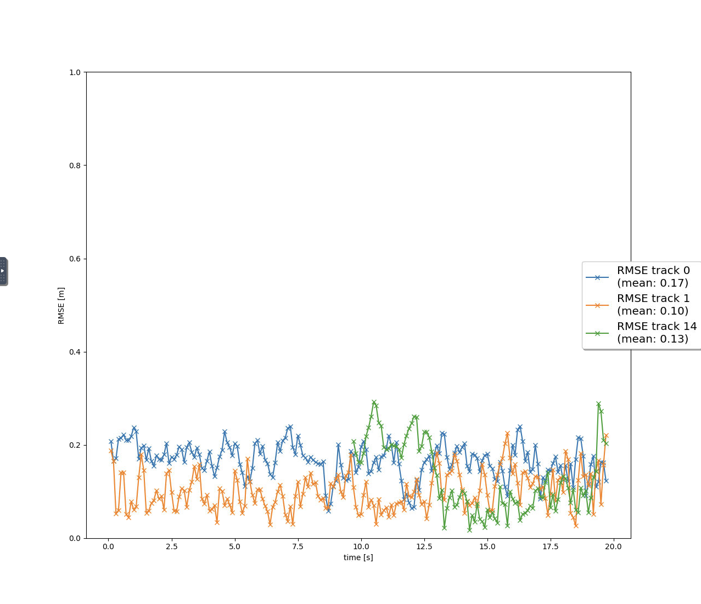

# Writeup: Track 3D-Objects Over Time

Please use this starter template to answer the following questions:

### 1. Write a short recap of the four tracking steps and what you implemented there (filter, track management, association, camera fusion). Which results did you achieve? Which part of the project was most difficult for you to complete, and why?

**Step 1 Filter**

In this task I implemented an Extended Kalman Filter by implement the `predict()` function and the `update()` function. For the `predict()` implemented the `F()` and the `Q()` function to calculate a system matrix for constant velocity process model in 3D and the corresponding process noise covariance depending on the current timestep dt. For the `update()` function I implemented the `gamma()`, the `S()`, the `get_hx` , `set_x()`, `set_p()`and `get_H` .

The RMSE value of the step 1 as seen in the figure below is 0.32 for frames of range [150,200] using sequennce 2 which is less than 0.35

**Step 2 Track Management**
In the Track class I replaced the track initialization values by initialization of track.x and track.P and also implemented the `manage_track()` function and the `handle_update_track()`

The result of the track management had a RMSE of 0.78 for frame of ranges [150,200] in sequence 2 as seen in the figure below

**Step 3 Association**
In this task I implement the `associate()` function to replace the association matrix based on the Mahalanobis distance for all the tracks in the track_list and meas_list. I made use of the `MHD()` function to implement the Mahalanobis distance and also implemented the `gating()` function to check if a measurement can be found inside a tracks gate.

I updated the list of `unassigned_meas` and `unassigned_tracks` to include the indices of all measurements and tracks that were not associated. I also implemented the `get_closest_track_and_meas` to get the minimum entry in `association_matrix` and remove corresponding `unassigned_tracks` and `unassigned_meas`

The RMSE error is observed to be less than 0.2 for all the tracks that are confirmed within the frame range [0,200] in Sequence 1. 

**Step 4 Camera Fusion**
I implemented the `in_fov()` function, the `get_hx()` function in order to handle zero division error and transform position estimate from vehicle to camera coordinates.

This was the most difficult part of the project as I had some errors implementing the `get_hx()` function.

The RMSE of all the tracks is observed to be below 0.2 as seen in the figure below.

### 2. Do you see any benefits in camera-lidar fusion compared to lidar-only tracking (in theory and in your concrete results)? 
 The use of Camera-LiDAR fusion is preferred over the LiDAR-only tracking system  because the results presented in the project are better:

I observed that there is a reduction in False Positives when using camera and lidar data.

I also observed that appearance based features like texture and  color that are available from cameras are very helpful in categorizing objects. This fusion of  LiDAR’s spatial precision and camera’s appearance information is therefore more reliable for object differentiation.

I observed that under low light, LiDAR works well, and cameras are better  under normal lighting, thus the system is robust to changes in lighting and weather.

I observed that the system is able to cover up for their deficiencies.  Cameras provides rich color and visual information  while accurate LiDAR output gives accurate measurements better of description distance of and the location.

### 3. Which challenges will a sensor fusion system face in real-life scenarios? Did you see any of these challenges in the project?

 Real time sensor fusion systems have their own set of issues and some of them were already seen in  the project:

Sensor Reliability and Data Quality: The data accuracy can be affected by rain,  fog, glare or dirt on sensors and other external/ environemental conditions. This is a general problem of all optical and  LiDAR become based unsync, systems.

Sensors many at times need to be recaliberated and maintained to ensure accuracy.

False Positives : I noticed some False positives during detection and also ghost tracking in the project.

Data Misalignment: The camera and LiDAR data may not be perfectly aligned and  hence there may be some gaps and this may result in some of the bounding boxes not accurately outlining an  object. Even slight misalignment can lead to errors in the fusion output.

Processing and Computational Challenges:  These systems need to process a large amount of data in real time, especially in the environment with many  objects moving at the same time. The high computational requirements may lead to delay and thus affect the  system’s response time.

Fast or Erratic Object Movements: Fast moving objects or those moving randomly can  be hard to track, especially when prediction algorithms are not developed to handle high rates of change in velocity  or direction.

Occlusions: In the situations with many people, some of them may be covered  and therefore it is not possible to follow them continuously. This needs good occlusion handling mechanisms. 

### 4. Can you think of ways to improve your tracking results in the future?

 To enhance the efficiency of tracking, the following modifications can be suggested for future versions:

Dynamic Noise Modeling: Using adaptive noise  models that are similar to the motion of the objects can enhance the robustness and the response of the  tracking system especially for highly dynamic objects.

Enhanced Fusion Strategies: This can be improved by first using  cameras for object detection and classification and then fine tuning the position using LiDAR measurements instead of using  LiDAR to initialize the tracking.

Environment Aware Algorithms: It is possible to develop models that can  work in different weather and light conditions and thus increase the robustness of the system. For example,  using dynamic thresholds for low visibility or worst case scenarios can help in improving the performance in extreme conditions.

 Improved Occlusion Handling: The use of more sophisticated occlusion prediction models will enable the system to anticipate  and solve cases where some objects hide others. Group interaction models will also be useful in enhancing the tracking.

 Application of Sophisticated Data  Association Algorithms: Multi Hypothesis Tracking, Joint Probabilistic Data Association or Global Nearest Neighbours can be employed to minimize the number of  ambiguities in crowded environment to improve the association of detections to tracks.

 Optimized Track Management: The development of better rules for creating and removing tracks (statistical  initialization, adaptive deletion thresholds) is vital for improving the overall correctness of the tracking algorithm. In addition,  dynamic scoring systems that reward continuous detection and penalize missing a detection point appropriately can help in improving the  track longevity.

Collaborative Multi-Sensor Networks: Using other sensors  like radar or ultrasonic can enhance the tracking accuracy by furnishing supplementary information that may not be available  from cameras or LiDAR in certain conditions.

