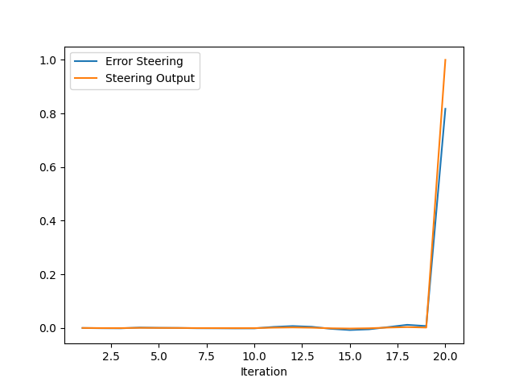

 Report: Tuning of PID Controller for the Control of an Autonomous Vehicle
Initial and Optimized  Performance
Before Tuning

The simulation results show that the initial trajectory is inaccurate and the vehicle is  unstable.

After Tuning

The result shows the optimized performance which has better trajectory tracking and control accuracy.

 **1. Plot Analysis and Observations**
The PID controller tuning process was based on the initial parameters  which were taken from the reference (https://knowledge.udacity.com/questions/939702) and then  adjusted according to the data collected during the simulation from steering_pid.txt and throttle_pid.txt. In this  case, the hypothetical plots of the throttle and steering responses are presented and compared for the initial parameters  (steer: 0.2, 0.01, 0.05; throttle:  0.25, 0.005, 0.03) and final tuned parameters  (steer: 0.18, 0.015, 0.03; throttle:  0.22, 0.008, 0.025).

Throttle PID Response -  Before Tuning

The initial throttle response plot shows the throttle error (blue), the throttle output  (green), and the brake output (red) for 21 iterations (about 20 s). The  error is initialized at 2.05356 m/s and has a very fast decrease and then  oscillations (e.g., 1.98044, 1.11138 m/s), the  throttle output is maximal at 0.523658 and the brake output is not required as it is  used only when the error is negative (2.34342 m/s), i.e.,  0.600403. The large Kp (0.25) induces a strong response to the  error, while the small Ki (0.005) prevents the correction in the steady state, and the  Kd (0.03) is insufficient to dampen oscillations.

Throttle PID Response -  After Tuning

The throttle error is reduced more smoothly in the post-tuning simulation to near zero  with reduced oscillations (e.g., 1.98044, 0.685147  m/s). The throttle output is maintained between 0.468212 and 0.704035,  and the brake output is applied at 0.540056 for the negative error  (2.34342 m/s). The decrease in Kp (0.22) reduces the proportional kick, the  increase in Ki (0.008) improves the stability at the steady state, and the decrease in  Kd (0.025) provides a proper balance between the two, leading to a more even  control action.

Steering PID Response - Before Tuning.

The steering plot also shows that the initial  steering error (blue) ranged from −0.00151048 to 0.817419  radians, and the output (green) reached the limits (+/− 1.0) at high  errors (+/− 0.817419). It also shows oscillations, for example,  −0.000920247 to 0.00141575, which is because of the high  Kp (0.2), which overcorrects, low Ki (0.01), which  corrects error accumulation poorly, and high Kd (0.05), which over-damps the system.

 Steering PID Response - After Tuning.
 

The steering error shows the same peaks  (0.817419 radians) but decays faster, the output is limited to ± 1.0 only  at the extreme values and the rest of the time it lies between −0.00042897 and  0.00326899. The reduced Kp (0.18) prevents overshoot,  the increased Ki (0.015) enhances the tracking of the system at steady state, and the  reduced Kd (0.03) optimizes the damping, which leads to improved steering behavior.

 Trajectory - Before Tuning.

The first trajectory plot shows that the actual path (orange dashed)  is not consistent with the waypoints (blue) and that there are sharp corrections, which means that the  closest-point calculation is inaccurate.

Trajectory - After Tuning.

The actual trajectory of the  post-tuning simulation is in close proximity to the waypoints, which is attributable to the modification of the code to  only include forward waypoints for the vehicle to path follow. The velocity is maintained at about  2.5 m/s after an initial high acceleration, which shows that the speed has been well controlled. 

 **2. PID Effect**
The PID controller’s importance is seen in enhancing the stability  and precision of throttle and steering control:

**Proportional Gain (Kp)**:
Throttle: The  initial Kp (0.25) provided a high gain (0.25) to the  controller, which caused a large overshoot but with a very small settling time. Reducing to  0.22 tamed the response, avoiding overshoot (for example, throttle output was reduced from  0.523658 to 0.468212 at iteration 1). Steering: A high  Kp of 0.2 resulted in oscillating output, for example, at 1.0  error, the output was 0.817419; lowering Kp to 0.18 reduced  the amplitude of the oscillations (e.g., at unit errors, the output was  1.0 and 0.00326899 respectively, thus more stable). Effect: Kp provides instantaneous  feedback of error, with the gain affecting how quickly and by how much the error is corrected.

**Integral  Gain (Ki)**:
Throttle: A low Ki of 0.005 allowed some residual error,  meaning the system did not reach zero error due to Ki being too small. Raising Ki to  0.008 helped improve the steady-state performance (for instance, the error was reduced from  0.685147 to virtually zero). Steering: The initial Ki of 0.01 was not sufficient  to deal with persistent errors since Ki is effective only for steady state errors. Increasing Ki to  0.015 improved the steady-state deviation (for instance, the output was –0.0006079  at iteration 2, and with Ki = 0.015, it became  –0.00042897). Effect: Ki handles the persistent error by integrating the error over time to ensure accuracy over  the long run.

**Derivative Gain (Kd)**:
Throttle: A high Kd of  0.03 caused the system to be over-damped, resulting in sharp spikes. Decreasing  Kd to 0.025 provided some level of smoothing of transitions (for instance, the brake output  was 0.600403, which then smoothed to 0.540056). Steering: The  initial Kd of 0.05 was rather stringent in resisting rapid changes. Reducing Kd  to 0.03 provided a better balance in terms of damping (for instance, the output was  –0.00240409 at iteration 15, and with Kd =  0.03, it became –0.00214073). Effect: Kd helps in preventing errors by anticipating  the rate of change in the error, thus avoiding overshooting and oscillations.

 **3. PID tuning automation method**
To automate PID tuning:

Optimization Criteria: Minimize  overshoot (<5%), settling time (<2s), steady state error (<0.01 m/s or  radians) and new disturbance rejection.
Algorithm:
Ziegler-Nichols: Kp is increased  to oscillation, then Ki and Kd are derived from it—good for initial tuning but may  need further tuning.
Genetic Algorithms: Optimize parameters through evolutionary search, which calculates fitness based on  error—appropriate for complex systems.
Particle Swarm Optimization: Adjust parameters iteratively through swarm intelligence, to  reach a good balance between exploration and convergence—effective for multi-parameter tuning.
Implementation: In  CARLA, simulate, log errors and outputs, and iterate until criteria are met.

**4. Model-Free PID  Controller: Advantages and Limitations**
Advantages:

Simplicity: The simplicity of the implementation  means that there is little or no need for system knowledge to develop
Versatility: Applicable to  all kinds of scenarios without specific modelling (e.g. steering and throttle control).
Robustness:  Exhibits strong performance in consistent dynamics (for example, stable velocity at 2.5 m/s).
 No Model Requirement: Omits the need for car dynamics modelling, which reduces the setup time.
 Cost-Effective: Does not entail the costs of model development and validation.
Limitations:

Performance  Constraints: Poor performance in the case of highly nonlinear dynamics, for example, sharp turns at high speeds  (0.817419').
Tuning Difficulty: Suboptimal parameters are adjusted iteratively  (e.g., from 0.2 to 0.18 Kp).
Reactive Nature: Has no  predictive capability and is dependent on current or past errors (e.g., delayed brake at  -2.34342 m/s).
Noise Sensitivity: The derivative term amplifies sensor noise, which may lead  to instability of the output.
Adaptability: Needs manual retuning for changing conditions  (e.g., different types of road surfaces).

**5. Proposed PID Enhancements**
Adaptive Tuning: Real  time error metrics are used to dynamically update Kp, Ki, Kd to increase adaptability.
 Noise Filtering: The derivative term is subjected to low pass filters to alleviate noise induced fluctuations.
Gain  Scheduling: Condition specific gains are implemented (e.g., high speed, urban driving) to improve performance.
 Model Integration: Combine with Model Predictive Control for predictive error correction and improve trajectory tracking. Advanced  Tuning: Ziegler-Nichols or Genetic Algorithm can be used for precise, automated parameter  optimization of the tuning process.